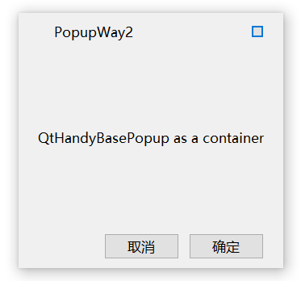

# QtHandy
封装了QtWidgets界面库（可以通过qss修改样式）以及开发中常用的接口封装。
- 测试QT版本：Q5.12(Windows)、Q5.15(Windows)
- 目前很多功能都处于开发中。

## 目录
- [功能](#功能)
- [使用](#使用)
- [文档](#文档)
- [贡献](#贡献)
- [常见问题](#常见问题)
- [许可证](#许可证)
- [联系](#联系)

## 功能
1. Widgets组件（时间选择器控件、弹窗、无边框等）
1. QhSingletonProcess 唯一进程类，程序只能有一个实例
1. QhDTWrapper 数据类型包装器
1. QhLogger 日志类
1. QhDataBase 数据库类
1. semvertool 版本号判断工具类
1. util 工具类（QhWidgetUtil等）

### 基础控件
[无边框/FramelessWindow]
, [按钮/PushButton]
, [复选框/CheckBox]
, [单选按钮/RadioButton]
, [行编辑器/LineEdit]
, [文本编辑器/TextEdit]
, [下拉框/ComboBox]
, [进度条/Progress]
, [滑块/Slider]
, [滚动条/ScrollBar]

### 复合控件
[日期时间 QhDateTimePicker](#UI_DATETIME)
, [分页控件 QhPaging](#UI_PAGING)
, [悬浮窗口 QhFloating]
, [导航栏 QhNavbar]

### 自定义控件
[弹窗基类 QhBasePopup](#UI_BASEPOPUP)
, [消息弹窗 QhMessageBox]
, [加载框 QhLoading]

## 使用
1. QT编译成动态库的方式调用
1. 用法可以参考Example中的示例

### 示例

#### 日期时间
示例图(样式可以通过qss修改)  

#### 分页控件
示例图(样式可以通过qss修改)  

#### 弹窗基类
使用场景：在项目中，弹窗的基本样式都是一样的，只是内容不一样，使用弹窗基类就可以保证弹窗样式保持一致。 
使用弹窗的几种方式，在Windows、Mac下支持圆角，示例图  

## 文档
暂无

## 贡献
欢迎贡献！如果你想贡献代码，通常需要进行以下步骤： 
1. Fork 该仓库。
1. 创建一个新的分支 (git checkout -b feature-branch)。
1. 提交你的修改 (git commit -am 'Add new feature')。
1. 推送到分支 (git push origin feature-branch)。
1. 创建一个 Pull Request。

## 常见问题

## 许可证
该项目遵循 MIT 许可证，详情请查看 LICENSE 文件。

## 联系
如果你有任何问题或建议，可以通过以下方式联系我们：
- Email: 1984989012@qq.com

