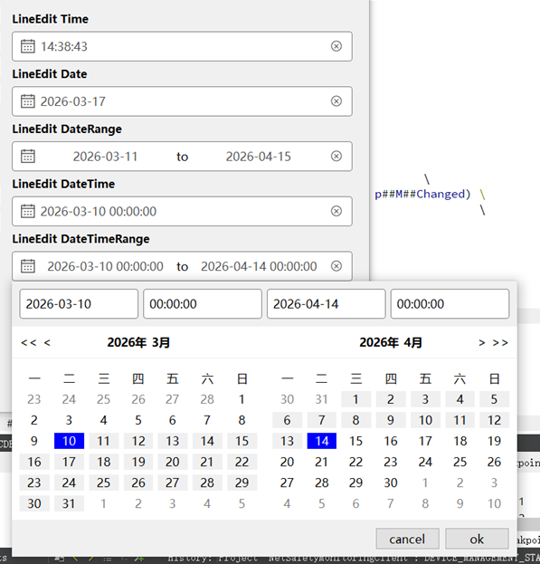
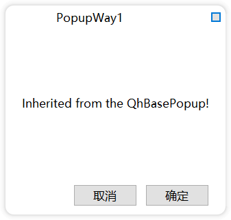
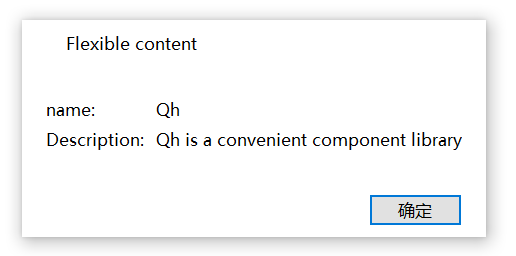

# QtHandy
1. QT widget组件库（可以自定义样式）以及常用的接口封装。
1. QT widget component library (with customizable styles) and commonly used interface encapsulation。
1. 测试的QT版本：Q5.12(Windows)、Q5.15(Windows)
1. 目前很多功能都处于开发中。

## 封装的常用类
1. Widgets组件（时间选择器控件、弹窗、无边框等）
1. QhSingletonProcess 唯一进程类，程序只能有一个实例
1. QhDTWrapper 数据类型包装器
1. QhLogger 日志类
1. QhDataBase 数据库类
1. semvertool 版本号判断工具类
1. util 工具类

## 工具类
1. 窗口工具类
1. 文件工具类
1. 图片工具类
1. 版本号工具类

## 控件
### 基础控件
[无边框/FramelessWindow]
, [按钮/PushButton]
, [复选框/CheckBox]
, [单选按钮/RadioButton]
, [行编辑器/LineEdit]
, [文本编辑器/TextEdit]
, [下拉框/ComboBox]
, [进度条/Progress]
, [滑块/Slider]
, [滚动条/ScrollBar]

### 复合控件
[日期时间 QhDateTimePicker](#UI_DATETIME)
, [分页控件 QhPaging](#UI_PAGING)
, [悬浮窗口 QhFloating]
, [导航栏 QhNavbar]

### 自定义控件
[弹窗基类 QhBasePopup](#UI_BASEPOPUP)
, [消息弹窗 QhMessageBox]
, [加载框 QhLoading]

### 日期时间
示例图(样式可以通过qss修改)  

### 分页控件
示例图(样式可以通过qss修改)  

### 弹窗基类
使用场景：在项目中，弹窗的基本样式都是一样的，只是内容不一样，使用弹窗基类就可以保证弹窗样式保持一致。 
使用弹窗的几种方式，在Windows、Mac下支持圆角，示例图  

