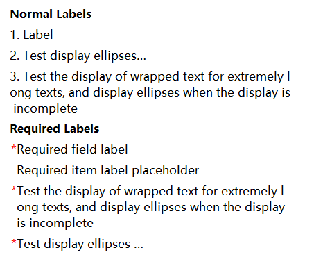
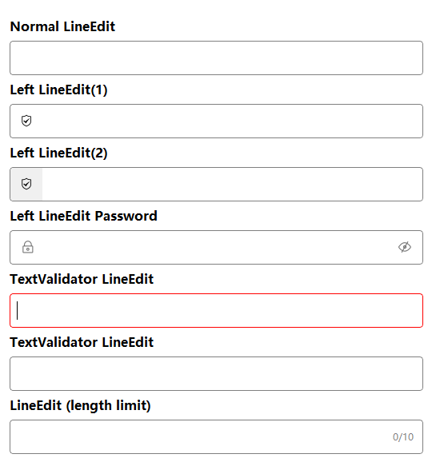
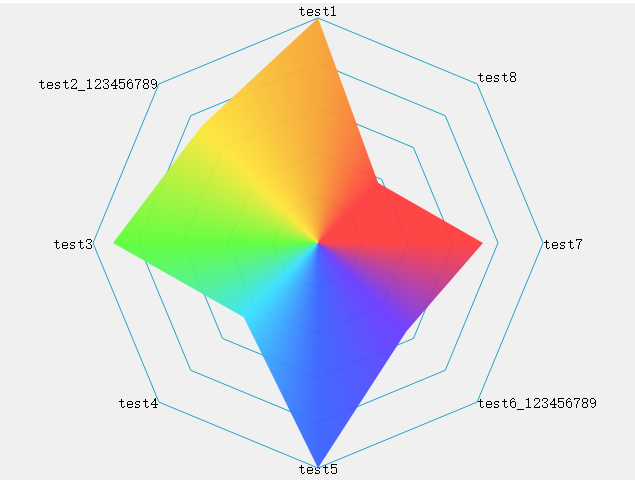

# QtHandy

封装了QT常用的功能以及界面组件，界面组件基于QtWidgets，界面组件最大优势是可以通过接口或者styleSheet设置样式。

- 目前测试的QT版本：Q5.12(Windows)、Q5.15(Windows)
- 如果编译不通过，请根据QT版本自行修改

## 目录

- [功能](#功能)
- [使用](#使用)
- [贡献](#贡献)
- [常见问题](#常见问题)
- [许可证](#许可证)
- [联系](#联系)

## 功能

| 类型   | 名称                                                              | 描述                                                                                                       | 状态               |
| ---- | --------------------------------------------------------------- | -------------------------------------------------------------------------------------------------------- | ---------------- |
| 窗口组件 | QhFramelessMainWindow QhFramelessWidget QhFramelessDialog | **无边框窗口** 1.拖动拉伸都是系统级别的； 2.目前存在部分瑕疵：  1）windows可拉伸时底部会有一个像素的丢失;  2）由于linux版本太多，可能需要更具实际情况调整； | 完成               |
| 窗口组件 | QhCheckBox                                                      | **复选框**（可以锁住状态，界面点击时不切换状态）                                                                               | 完成               |
| 窗口组件 | QhComboBox                                                      | **下拉框**（可以限制鼠标滚轮切换值）                                                                                     | 完成               |
| 窗口组件 | QhLabel [示例图](#UI_LABEL)                                        | **文本标签**（支持换行、省略号显示、必填项符号“*”）                                                                            | 完成               |
| 窗口组件 | QhLineEdit [示例图](#UI_LINEEDIT)                                  | **行编辑器**（支持图标、输入校验、输入长度限制等）                                                                              | 完成               |
| 窗口组件 | QhLineEditDateTime [示例图](#UI_DATETIME)                          | **日期时间行编辑器**                                                                                             | 完成               |
| 窗口组件 | QhProgressBar [示例图](#UI_PROGRESSBAR)                            | **进度条**（支持水平线性、圆形、仪表盘进度条）                                                                                | 完成               |
| 窗口组件 | QhDateTimePicker [示例图](#UI_DATETIME)                            | **日志时间选择器控件**                                                                                            | 完成               |
| 窗口组件 | QhTimePicker [示例图](#UI_PAGING)                                  | **时间选择器控件**                                                                                              | 完成               |
| 窗口组件 | QhRadarChart [示例图](#UI_RADARCHART)                              | **雷达图**（目前主要支持数据分布样式）                                                                                    | 完成               |
| 窗口组件 | QhFloating                                                      | **悬浮窗口**                                                                                                 | 完成               |
| 窗口组件 | QhNavbar                                                        | **导航栏**                                                                                                  | <mark>进行中</mark> |
| 窗口组件 | QhBasePopup                                                     | **弹窗基类**（统一弹窗样式）                                                                                         | 完成               |
| 窗口组件 | QhMessageBox                                                    | **消息弹窗**（类似QMessageBox，只是自定义了样式）                                                                         | 完成               |
| 窗口组件 | QhLoading                                                       | **加载框**（在执行耗时操作时，可以显示价值框）                                                                                | 完成               |
| 单利进程 | QhSingletonProcess                                              | **单利进程**（保证同时只能启动一个界面程序）                                                                                 | 完成               |
| 日志   | QhLogger                                                        | **日志记录工具**（支持同步、异步写日志）                                                                                   | 完成               |
| 数据   | QhDTWrapper                                                     | **数据类型包装器**                                                                                              | 完成               |
| 数据库  | QhDataBase                                                      | **数据库类相关**                                                                                               | <mark>进行中</mark> |
| 工具类  | semvertool                                                      | **版本号工具类**（主要用于判断版本号的大小）                                                                                 | 完成               |
| 工具类  | QhWidgetUtil                                                    | **窗口工具类**                                                                                                | 完成               |
| 工具类  | QhMathUtil                                                      | **数学相关工具类**                                                                                              | <mark>进行中</mark> |
| 工具类  | QhImageUtil                                                     | **图片相关工具类**                                                                                              | <mark>进行中</mark> |
| 工具类  | QhFileUtil                                                      | **文件相关工具类**                                                                                              | <mark>进行中</mark> |

### 界面组件参考图

#### 日期时间

示例图(样式可以通过qss修改)  

#### 分页控件

示例图(样式可以通过qss修改)  

#### 弹窗基类

使用场景：在项目中，弹窗的基本样式都是一样的，只是内容不一样，使用弹窗基类就可以保证弹窗样式保持一致。 
使用弹窗的几种方式，在Windows、Mac下支持圆角，示例图  

#### 标签

#### 行编辑器

#### 进度条

#### 雷达图

## 使用

1. QT编译成动态库的方式调用
2. 用法可以参考Example或Test中的示例

## 贡献

欢迎贡献！如果你想贡献代码，通常需要进行以下步骤： 

1. Fork 该仓库。
2. 创建一个新的分支 (git checkout -b feature-branch)。
3. 提交你的修改 (git commit -am 'Add new feature')。
4. 推送到分支 (git push origin feature-branch)。
5. 创建一个 Pull Request。

## 常见问题

## 许可证

该项目遵循 MIT 许可证，详情请查看 LICENSE 文件。

## 联系

如果你有任何问题或建议，可以通过以下方式联系我们：

- Email: 1984989012@qq.com
